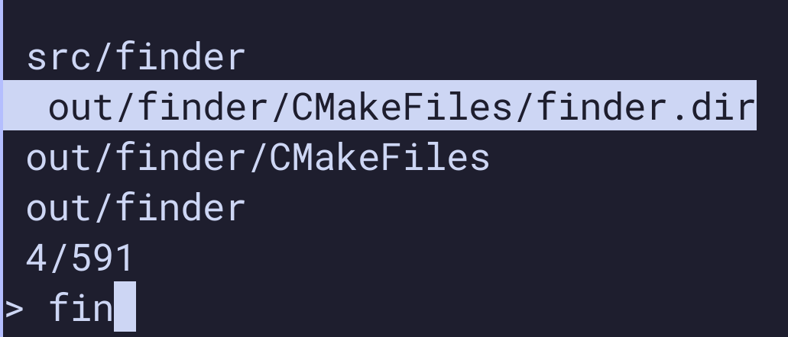

# fzf-folder
The purpose of this tool is to be able to fuzzy find
for folder names using fuzzy searching from the command line.
Note that this tool is very much a work in progress and that you can most likely
solve this problem with already existing tools. The main point of this project is to
be a playground for testing tools/features related to C++ development.



## Building

Download [pixi](https://prefix.dev/)

Run the following command to show build options:

```bash
pixi task list
Tasks that can run on this machine:
-----------------------------------
build, clean, generate, release
```

* **Build:** Build project using build files in out folder
* **Clean:** Removes existing build files
* **Generate:** Generates build files with cmake
* **Release:** Generates and builds projects with release build flags

## Usage

Type the command in your terminal with an optional path:

```bash
fzf-folder <optional-path>
```

Use either the arrow keys or TAB and shift+TAB to navigate up or down.
Press ENTER to choose an option, the program will output the relative path.
Press ESCAPE to abort, the program will output nothing.


## TODO

* Optimize initial find for folders, maybe detach this search to a separate thread or implement multithreaded search.
* Create a better match algorithm, currently just checks that the search string is a subset of the path
* Implement some flags such as fullpath or case-insensitive for example
* Cleanup toolchain file and reorganize how toolchain and main cmake files are located in the project
